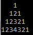
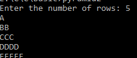
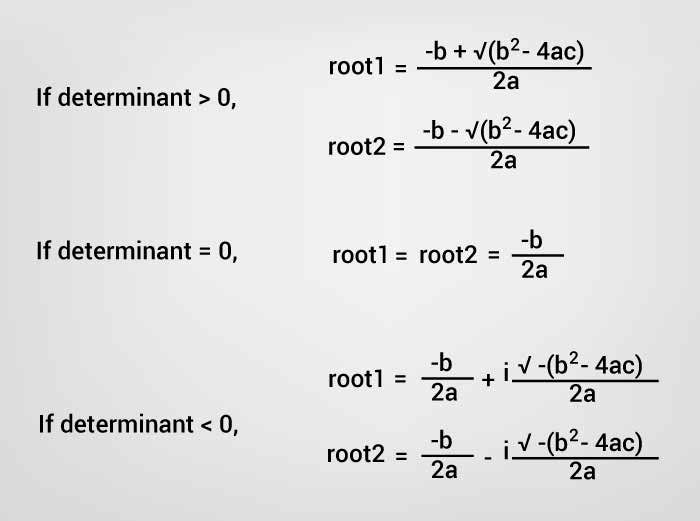
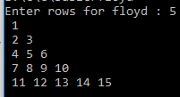

### HelloWorld ###
```C
#include <stdio.h>
#include <conio.h>

void main(){
    printf("Hello world");
    getch();    
}

```

### Pointers ###
Pointers.points to an address(memory location) of a value.It reduces the code and improves the performance(we can dynamically allocate memory using malloc() and calloc() functions using pointer)

```c
#include <stdio.h>      
#include <conio.h>    
void main(){      
int number=50; // pointer declare 
int *p;    
clrscr();  
p=&number;//stores the address of number variable  
      
printf("Address of number variable is %x \n",&number);  
printf("Address of p variable is %x \n",p);  //
printf("Value of p variable is %d \n",*p);  //value print
  
getch();      
}      
```
### NULL Pointer ##

`int *p=NULL;`

### Pointer to Pointer ###

 a pointer refers to the address of another pointer.
`int **p2; `

```C
#include <stdio.h>        
#include <conio.h>      
void main(){        
int number=50;    
int *p;//pointer to int  
int **p2;//pointer to pointer      
clrscr();    
p=&number;//stores the address of number variable    
p2=&p;  
        
printf("Address of number variable is %x \n",&number);    
printf("Address of p variable is %x \n",p);    
printf("Value of *p variable is %d \n",*p);    
printf("Address of p2 variable is %x \n",p2);    
printf("Value of **p2 variable is %d \n",**p);    
    
getch();        
}        
```

### Runtime memory allocation ###
```C
#include <stdio.h>
#include <conio.h>

void main(){
    /*
    n = store array size
    *arr = pointer variable
    i = store array index 
    */
    int i,n,*ptr;
    printf("Enter number of elements: ");  
    scanf("%d",&n); 

    //memory allocated using calloc at runtime 
    int *arr = (int *) malloc(sizeof(int*)*n);
    printf("size is %d\n", sizeof(arr));

    printf("Enter elements of array: ");  
    for(i=0;i<n;i++) 
         scanf("%d",&arr[i]);  

    //print array
    for(i=0;i<n;++i) 
        printf("%d ", arr[i]);   

}
```

### Function ###

Advantage :

1. Code Reusability
2. we don't need to write much code so it makes the code optimized

Here create `add` function.

```C
#include <stdio.h>
#include <conio.h>
int add(int n1,int n2) {  
    return n1 + n2;
}  
void main(){
    int num1,num2;
    printf("Enter two number for add : ");
    scanf("%d %d",&num1,&num2);
    printf("sum of %d and %d = %d",num1,num2,add(num1,num2));
    getch();    
}
```
### Function call by value ###
In call by value, original value(function param) is not modified. in the above example num1,num2 can't modified 

### Function call by referece ###
In call by referece, original value(function param) is modified. 

```C
#include <stdio.h>
void passref(int *a){
    *a += 2;
}

void main(){
    int a=5;
    passref(&a);
    printf("Pass ref : %d",a);
    getch();
} 

```
### Recursion ###

When function is called within the same function, it is known as recursion function.
5! = 5x4x3x2x1 = 120 <br/>
0! = 1

```C
#include <stdio.h>
#include <conio.h>

int factorial(int n){
    if(n < 0)
        return -1; //wrong input
    else if(n == 0)
        return 1;
    else
        return n * factorial(n - 1); //call in same function
}
void main(){
    /*
    num = store number that need find factorial
    */
    int num; 
    printf("Enter a number \n");
    scanf("%d",&num);
   
    //using recursive function     
    printf("Factorial of !%d=%d",num,factorial(num));

}
```
### String ###

String in C language is an array of characters that is terminated by \0 (null character).
There are two ways to declare string in c language.

1. By char array `char s1[]={'s','h','a','m','i','m','\0'}`
2. By string literal `char s1[]="shamim"`


### String input/output ###

```C
#include <stdio.h>  
#include <conio.h>  
  
void main(){  
    char name[100];  
    puts("Enter your name: ");  

    gets(name); //reads string from user

    puts("Your name is: ");  
    puts(name);  //displays string 
   
    getch();  
} 
```

### String Function ###

```C
#include <stdio.h>
#include <conio.h>
int add(int n1,int n2) {  
    return n1 + n2;
}  
void main(){
    char fname[50],lname[50];  
    gets(fname);  
    gets(lname);  

    //strlen function usage
    printf("Length of your fname %d\n",strlen(fname)); 

    //strcpy function usage
    printf("Your last name %s\n",strcpy(fname,lname)); 

    //strcat function usage
    printf("Your full name %s\n",strcat(fname,lname));   

    //strcmp function usage
    if(strcmp(fname,lname)==0)  
      printf("fname and lname are equal");  
    else  
      printf("fname and lname are not equal");  

    //strrev function usage
    printf("Reverse of fname is : %s\n",strrev(fname));

    //strlwr function usage
    printf("Lower case of fname is : %s\n",strlwr(fname)); 

    //strupr function usage
    printf("Upper case of fname is : %s\n",strupr(fname));

    char *sub;
    sub = (char *)strstr("shamim miah shamim miah","miah");  //first occurrence till matched string 
    printf("\nSubstring is: %s",sub);      
}

```

### Structure ###

Structure is a user defined datatype that allows you to hold different type of elements. It works like a template in C++ and class in Java

```C
#include <stdio.h>
#include <conio.h>
struct employee  {   
    int id;  
    char name[50];  
    float salary;  
};
void main(){
    struct employee e1; 
    e1.id=101; // or e1->id=101
    strcpy(e1.name, "Sonoo Jaiswal");
    e1.salary=25000;
    printf( "employee id : %d\n", e1.id);  
    printf( "employee name : %s\n", e1.name);        
    printf( "employee salary : %f\n", e1.salary);        
}

```

### Nested Structure ###

```C
#include <stdio.h>
#include <conio.h>

struct Date  
{  
   int dd;  
   int mm;  
   int yyyy;   
};
struct employee  {   
    int id;  
    char name[50];  
    float salary; 
    struct Date joindate; 
    /*
    or
    struct joinDate  
    {  
      int dd;  
      int mm;  
      int yyyy;   
    }joindate;
    */   
};
void main(){
    struct employee e1; 
    e1.id=101; // or e1->id=101
    strcpy(e1.name, "Sonoo Jaiswal");
    e1.salary=25000;
    e1.joindate.dd=10;  
    e1.joindate.mm=11;  
    e1.joindate.yyyy=2014;
    printf( "employee id : %d\n", e1.id);  
    printf( "employee id : %d\n", e1.joindate.dd);  
    printf( "employee name : %s\n", e1.name);        
    printf( "employee salary : %f\n", e1.salary);  

}
``` 

### Structures Array ###

```C
#include <stdio.h>
#include <conio.h>
struct employee  {   
    int id;  
    char name[50];  
    float salary;  
};
void main(){
    struct employee emp[2]; 
    int i;
    for(i = 0;i < 2;i++){
        scanf("%d",&emp[i].id);
        scanf("%s",&emp[i].name);
        scanf("%f",&emp[i].salary);
    }

    //print
    for(i = 0;i < 2;i++){
        printf("%d",emp[i].id);
        printf("%s",emp[i].name);
        printf("%f\ln",emp[i].salary);
    }

}

```

### Union ###
Like structure, Union in c language is a user defined datatype that is used to hold different type of elements.

But it doesn't occupy sum of all members size. It occupies the memory of largest member only

```C
union employee  
{   int id;  
    char name[50];  
    float salary;  
}; 
```

### Leap Year ###
 ```C
 #include <stdio.h>
#include <conio.h>

void main(){
    int y;

    printf("Enter a year");
    scanf("%d",&y);

    //if divible by 400
    if(y % 400 == 0)
        printf("%d is a leap year", y);
    //if divible by 100
    else if(y % 100 == 0)
        printf("%d is a not leap year", y);

    ////if divible by 4
    else if (y % 4 == 0)
        printf("%d is a leap year", y);
    else
        printf("%d is a not leap year", y);

}
```
### GCD(Greatest Common Divisor)/HCF ###
6 divisor = 1,2,3,6 and 10 divisor = 1,2,5,10 <br>
CD = 1,2<br>
GCD = 2

```C
#include <stdio.h>
#include <conio.h>

void main(){
    /*
    gcd = store gcd latest value
    i = store divider value
    */
    int n1, n2, gcd,i; 
    printf("Enter two positive integers: ");
    scanf("%d %d", &n1, &n2);
    //i <= n1 && i <= n2 check divider between twos
    for(i = 1; i <= n1 && i <= n2; i++){
        // divide numbers by divider
        if(n1 % i == 0 && n2 % i == 0)
            gcd = i; // store i as gcd
    }
    printf("gcd of %d and %d is = %d",n1,n2,gcd);

}
```
### LCM(Lowest Common Multiple) ###

| Mutiple of 5 | Mutiple of 8 |
| --- | --- |
| 5 x 1 = 5 | 8 x 1 = 8|
| 5 x 2 = 10 | 8 x 2 = 16|
| 5 x 3 = 15 | 8 x 3 = 24|
| 5 x 4 = 20 | 8 x 4 = 32|
| 5 x 5 = 25 | 8 x 5 = 40|
| 5 x 6 = 30 | |
| 5 x 7 = 35 | |
| 5 x 8 = 40 | |

CM = 40 <br/>
LCM = 40

```C
#include <stdio.h>
#include <conio.h>

void main(){
    /*
    lcm = store lcm  value
    */
    int n1, n2,lcm; 
    printf("Enter two positive integers: ");
    scanf("%d %d", &n1, &n2);

    //lcm minimum(start) value get
    lcm = n1 > n2 ? n1 : n2;

    //create infinite loop.do'nt worry we break it soon
    while(1){

        if(lcm % n1 == 0 && lcm % n2 == 0){
            printf("lcm of %d and %d is = %d",n1,n2,lcm);
            break;
        }
        ++lcm; // increment lcm value by 1

    }
    

}
```
### Factorial ###
5! = 5x4x3x2x1 = 120 <br/>
0! = 1
```C
#include <stdio.h>
#include <conio.h>

int factorial(int n){
    if(n < 0)
        return -1; //wrong input
    else if(n == 0)
        return 1;
    else
        return n * factorial(n - 1);
}
void main(){
    /*
    num = store number that need find factorial
    fact = store factorial result
    i = store factorial multiple value
    */
    int num,fact = 1,i; 
    printf("Enter a number \n");
    scanf("%d",&num);
    /*if(num == 0)
    else    
        for(i = num; i > 0; i--)
            fact = i * fact;
    */
    //using recursive function
    fact = factorial(num);      
    printf("Factorial of !%d=%d",num,fact);

}
```
### 1 + 2 + 2 ......+n ###

```
#include <stdio.h>
#include <conio.h>

void main(){
    /*
    max = store maximum number of series
    sum = store summation result
    i = store individual value of series
    */
    int max,i;
    int sum=0;

    printf("Enter the n i.e. max values of series: ");
    scanf("%d",&max);

    printf("Sum of the series: ");

    for(i =1;i <= max;i++){
         printf("%d ",i);
         if(i != max)
            printf(" + ");
         sum += i;
     }
     printf(" = %d ",sum);

}
```
### Mattrix Multiplication ###


```C 
#include <stdio.h>
#include <conio.h>

void main(){
    /*
    a = store 1st Matrix
    b = store 2st Matrix
    m = store Multiply Matrix result
    r = no of row
    c = no of column
    i,j,k = array index store
    */
    int a[10][10],b[10][10],mul[10][10],r,c;
    int i,j,k;
    printf("enter the number of row=");  
    scanf("%d",&r);

    printf("enter the number of column=");  
    scanf("%d",&c); 

    //creat a create
    for(i=0;i<r;i++)
        for(j = 0; j < c; j++)
            scanf("%d",&a[i][j]); 

    // create b matrix        
    for(i=0;i<r;i++)
        for(j = 0; j < c; j++)
            scanf("%d",&b[i][j]);

    //mutipley        
    for(i=0;i<r;i++)
        for(j = 0; j < c; j++)
            for(k = 0; k < c; k++)  
                mul[i][j] += a[i][k] * b[k][j];

    //print result
    for(i=0;i<r;i++)
        for(j = 0; j < c; j++)
            printf("%d\t",mul[i][j]);
        //printf("\n");
}
```

### Pyramid ###


```C
#include <stdio.h>
#include <conio.h>

void main(){
    /*
    n=pyramid row
    i = store individual value
    i,j,l,k = printing purpose
    */
    int n,i,j,l,k;

    printf("Enter a number \n");
    scanf("%d",&n);
    for(i=1;i<=n;i++){

        //space print
        for(j = 1; j <= n-i;j++)
            printf(" ");
        
        //number print
        for(k=1;k<=i;k++)  
            printf("%d",k);

        //number print decending
        for(l=i-1;l>=1;l--)
            printf("%d",l);

        //new line
        printf("\n");         

    }  

}
```
### Prime Number ###

```C
#include <stdio.h>
#include <conio.h>

void main(){
    /*
    n = number that need check prime number
    isPrime = flag for prime number yes
    i = divided value
    */
    int i,n,isPrime = 1;
    printf("enter a numebr");  
    scanf("%d",&n); 
    for(i = 2; i < n/2; i++){
        if(n % i == 0){
            isPrime = 0;
            break;
        }
    }
    if(isPrime == 1)
        printf("%d is a prime number\n",n );
    else
        printf("%d is not a prime number\n",n );

}
```
### Fibonacci(0, 1, 1, 2, 3, 5, 8, 13, 21) ###

```C
#include <stdio.h>
#include <conio.h>

void main(){
    /*
    num = how many fibonacci  need
    sum = sum of privious and current number
    i = only for looping
    n1 = Store Ist number
    n2 = Store 2nd number
    */
    int n1 = 0,n2 = 1,sum,i,num;
    printf("How many fibonacci  need ? ");  
    scanf("%d",&num); 
    //printing first two fibonacci
    printf("\n%d %d",n1,n2);
    //loop starts from 2 because 0 and 1 are already printed   
    for(i=2;i<num;i++){
        sum = n1 + n2;
        printf(" %d",sum);
        // regenerate previous number before disply numer
        n1 = n2;
        n2 = sum; 
    }

}
```
### Palindrome ###
if a number is equal to its reverse number then it is called palindrome number. <br/>
131 = 131(reverse)

```C
#include <stdio.h>
#include <conio.h>

void main(){
    /*
    n = store number that needs to check palindrome
    reverse = store reverse result
    r = store reminder
    dividend = store division result 
    */
    int n,reverse=0,r,dividend;

    printf("Enter a number to check palindrome ? ");  
    scanf("%d",&n);
    //get initial dividend
    dividend = n;

    //until dividend greater than 0
    while(dividend>0)  { 
        //reminder 
        r=dividend%10;
        //generate reverse  
        reverse=(reverse*10)+r; 
        //division result 
        dividend=dividend/10;  
    }  
    if(n == reverse)  
        printf("%d is a palindrome number " , n);  
    else  
        printf("%d is not a palindrome number " , n);  

}
```
### swap two numbers without using third variable ###
```C
#include<stdio.h>  
#include<conio.h>  
main()  {  
    int a=10, b=20;    
    printf("Before swap a=%d b=%d",a,b);    
      
    a=a+b;//a=30 (10+20)  
    b=a-b;//b=10 (30-20)  
    a=a-b;//a=20 (30-10)  
      
    printf("\nAfter swap a=%d b=%d",a,b);  
    getch();  
} 
```
### Decimal To binary ###
5 = 101 (binary)

```C
#include <stdio.h>
#include <conio.h>

void main(){
    /*
    n = store number that needs convert binary
    binary = store binary result
    r = store reminder
    dividend = store division result 
    */
    int n,binary=0,r,dividend;

    printf("Enter a number to convert binary ? ");  
    scanf("%d",&n);
    //get initial dividend
    dividend = n;

    //until dividend greater than 0
    while(dividend>0)  { 
        //reminder 
        r=dividend%2;
        //generate reverse  
        binary=(binary*10)+r; 
        //division result 
        dividend=dividend/2;  
    }
    printf("%d binary = %d \n",n,binary );
}
```
### binary To Decimal ###
101 (binary) = 5
```C
#include <stdio.h>
#include <conio.h>
#include <math.h>

void main(){
    /*
    n = store number that needs convert decimal
    decimal = store decimal result
    r = store reminder
    dividend = store division result
    i = store power value 
    */
    int n,decimal=0,r=0,i=0,temp;

    printf("Enter a binary to convert decimal ? ");  
    scanf("%d",&n);
    temp=n;

    //until dividend greater than 0
    while(n != 0)  { 
        //reminder 
        r=n%10;
        //generate reverse  
        decimal += r * pow(2,i); 
        //division result 
        n = n/10;
        i++;  
    }
    printf("%d binary = %d \n",temp,decimal );
}
```
### Pyramid ###

```C
#include <stdio.h>
#include <conio.h>

void main(){
    /*
    rows = How many rows to generat pyramid
    i = rows looping
    j = print loopint
    alphabet = store character
    */
    int i, j, rows,alphabet='A';

    printf("Enter the number of rows: ");
    scanf("%d",&rows);

    for(i=1; i <= rows; ++i)
    {
        for(j=1;j<=i;++j)
        {
            printf("%c", alphabet);
        }
        ++alphabet;

        printf("\n");
    }
    getch();
}
```

### Roots of a 2x^2 + 3x -1 ###

```C
#include <stdio.h>
#include <conio.h>

void main(){
    /*
    a, b, c = coefficients of equation
    
    */
    double a, b, c,determinant;

    printf("Enter coefficients a, b and c: ");
    scanf("%lf %lf %lf",&a, &b, &c);

    determinant = b*b-4*a*c;
    if(determinant  > 0)
        root1 = (-b+sqrt(determinant))/(2*a);
        root2 = (-b-sqrt(determinant))/(2*a);

        printf("root1 = %.2lf and root2 = %.2lf",root1 , root2);
    }
    //condition for real and equal roots
    else if (determinant == 0)
    {
        root1 = root2 = -b/(2*a);

        printf("root1 = root2 = %.2lf;", root1);
    }

    // if roots are not real 
    else
    {
        realPart = -b/(2*a);
        imaginaryPart = sqrt(-determinant)/(2*a);
        printf("root1 = %.2lf+%.2lfi and root2 = %.2f-%.2fi", realPart, imaginaryPart, realPart, imaginaryPart);
    }
    getch();
}
```
### display ASCII values of character ###
```C
#include <stdio.h>
#include <conio.h>

void main(){
    /*
    lcm = store lcm  value
    */
    int i;
    for(i=0;i<=255;i++)
         printf("ASCII value of character %c: %d\n",i,i);
    getch(); 

}

```
### FLOYD'S TRIANGLE ###

```C
#include <stdio.h>
#include <conio.h>

void main(){
    /*
    n = store rows for floyd
    i,j = store ierator
    k = store display number
    */
    int n, i,j,k=1; 
    printf("Enter rows for floyd : ");
    scanf("%d", &n);
    
    for(i=1;i<=n;i++){
        for(j=1;j<=i;j++)
            printf(" %d",k++);
        printf("\n");
    }
    getch();
}
```

### Perfect Number ###
the sum of its positive divisors excluding the number itself
6 divisor 1,3,2(sum = 6)

```C
#include <stdio.h>
#include <conio.h>

void main(){
    /*
    n = store number that needs to check perfect
    sum = store summation result
    i = store individual value
    */
    int n,i=1,sum=0;

    printf("Enter a number: ");
    scanf("%d",&n);

    while(i<n){
       if(n%i==0)
           sum += i;
      i++;
    }
    if(sum == n)
      printf("%d is a perfect number",i);
    else
      printf("%d is not a perfect number",i);
}
```
### Display own source code ###
```C
#include<stdio.h>

int main(){
    FILE *fp;
    char c;

    fp = fopen(__FILE__,"r");
 
    do{
         c= getc(fp);
         putchar(c);
    }
    while(c!=EOF);

    fclose(fp);
   
    return 0;
}
```


